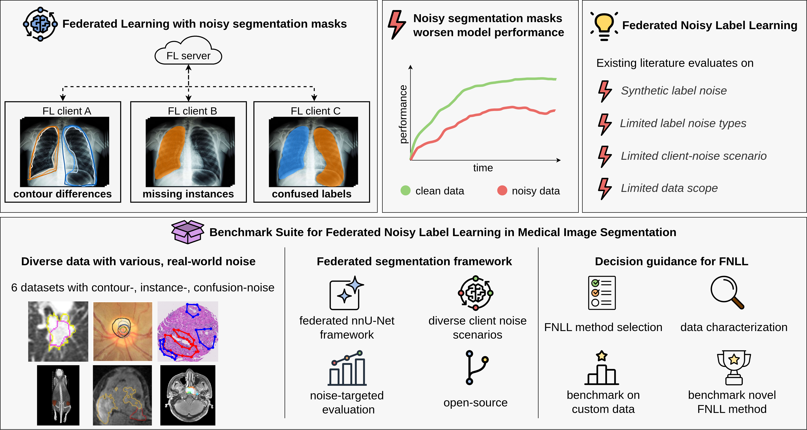

# A Benchmark Suite for Method Selection in Federated Noisy Label Learning

## Abstract

**Objective:**
Federated learning (FL) enables collaborative model training without centralizing sensitive data, making it particularly relevant for medical imaging. Yet, its deployment in medical image segmentation is challenged by real-world data imperfections across institutions, including label noise manifested as contour disagreement, missing or additional structures, or confused labels. Although federated noisy label learning (FNLL) aims to mitigate these effects, existing studies commonly evaluate methods on few datasets, simplified settings, and synthetic noise types.
We address the lack of standardized benchmarking resources for FNLL in cross-silo medical image segmentation by introducing a benchmark suite combining diverse real-world noisy datasets, deployment-relevant client-noise scenarios, and label-noise-targeted evaluation.

**Materials & Methods:**
The suite combines the curation of diverse, real-world noisy medical image segmentation datasets with a comprehensive federated segmentation framework including various client-noise scenarios and noise-targeted evaluation.
To demonstrate its capabilities, we compare representative FNLL methods across approaches, including noise-aware aggregation, robust personalization, label correction, and sample selection.

**Results:**
In-depth data analysis shows that real-world segmentation label noise occurs both in isolation and in combinations of characterized noise types.
The benchmark identifies *FedSelect* as the strongest overall FNLL method, underlines *FedAvg* as a competitive baseline, and provides an actionable decision guide to support selection of suitable FNLL strategies based on label-noise type and client-noise scenario.

**Discussion & Conclusion:**
The presented suite provides a realistic and discriminative basis for FNLL evaluation in medical image segmentation and establishes a reusable foundation for fair benchmarking, dataset-specific label-noise characterization, and future method development under realistic federated settings. Code is available at [https://github.com/MIC-DKFZ/FedSegNoiseBench](https://github.com/MIC-DKFZ/FedSegNoiseBench).


*Figure 1: Segmentation label noise of various forms degrades model training and poses a particular challenge in FL, where noisy annotations are distributed across clients and cannot be centrally inspected. While FNLL methods aim to address this problem, existing literature is often limited to few and synthetic noise types, restricted client-noise scenarios, and narrow data scope. Our benchmark suite closes this gap by combining diverse real-world noisy segmentation datasets, a federated benchmarking framework, and comprehensive noise-targeted evaluation, thereby enabling FNLL method selection, dataset characterization, benchmarking on new data, and evaluation of newly developed FNLL methods.*

### Citation
```
Will be updated upon acceptance of manuscript "Federated Medical Image Segmentation under Real-World Label Noise: A Benchmark Suite for Noisy Label Learning Method Selection".
```

## Usage

<details>
<summary>Setup</summary>

### Setup

Create and populate the Python environment from the repository requirements:

```bash
python3 -m venv .venv
source .venv/bin/activate
pip install -r requirements.txt
```

The repository also provides Make targets for the local development environment:

```bash
make
make update
make clean
```

Set the nnU-Net paths before preparing data or running experiments:

```bash
export nnUNet_raw="/path/to/nnUNet_raw"
export nnUNet_preprocessed="/path/to/nnUNet_preprocessed"
export nnUNet_results="/path/to/nnUNet_results"
```

</details>

<details>
<summary>Data</summary>

### Data

#### Download

Download the raw source datasets from their original providers and keep them
outside the repository. 
Download respective datasets from here:
- LIDC: [images and labels](https://www.cancerimagingarchive.net/collection/lidc-idri/)
- RIGA: [images and labels](https://deepblue.lib.umich.edu/data/concern/data_sets/3b591905z)
- Gleason: [images](https://dataverse.harvard.edu/dataset.xhtml?persistentId=doi:10.7910/DVN/OCYCMP) and [labels](https://springernature.figshare.com/articles/dataset/Pathologist-like_explainable_AI_for_interpretable_Gleason_grading_in_prostate_cancer/27301845)
- MouseTumor: [images and labels](https://www.nature.com/articles/s41597-024-03814-y)
- MMIS: [images and labels](https://mmis2024.vercel.app/)
- MMIA: [images and labels](https://www.synapse.org/Synapse:syn60868042/wiki/628716)

#### Preparation

The inherently noisy segmentation datasets are prepared to obtain a noisy and a clean (conensus or expert) version of the datasets.
This is done by calling their respective `prepare.py` script:

```text
src/data/lidc-idri/prepare.py
src/data/riga/prepare.py
src/data/gleasonxai/prepare.py
src/data/mouse-tumor/prepare.py
src/data/mmis/prepare.py
src/data/mama-mia/prepare.py
```

<details>
<summary>Prepare LIDC dataset
...
</details>

<details>
<summary>Prepare RIGA dataset
...
</details>

<details>
<summary>Prepare GleasonHD dataset
...
</details>

<details>
<summary>Prepare MouseTumor dataset</summary>

Prepare data to clean FL clients (STAPLE consensus):
```bash
python src/data/mouse-tumor/prepare.py \
  --raw_data_path /path/to/mouse-tumor \
  --single_seg_mode staple \
  --dataset_ids "301 302 303"
```

Prepare data to noisy FL clients (random annotator per sample):
```bash
python src/data/mouse-tumor/prepare.py \
  --raw_data_path /path/to/mouse-tumor \
  --single_seg_mode random \
  --dataset_ids "304 305 306"
```

`$nnUNet_raw` is read from the environment (no CLI arg needed).
</details>

<details>
<summary>Prepare MMIS dataset</summary>
Prepare data to clean FL clients:
```
python src/data/mmis/prepare.py \
  --raw_data_path /path/to/mmis \
  --single_seg_mode majority \
  --dataset_ids "700 701 702 703"
```

Prepare data to noisy FL clients:
```
python src/data/mmis/prepare.py \
  --raw_data_path /path/to/mmis \
  --single_seg_mode rater \
  --dataset_ids "704 705 706 707"
```
</details>

<details>
<summary>Prepare MAMA-MIA dataset</summary>

Prepare data to clean FL clients (expert segmentations):
```bash
python src/data/mama-mia/prepare.py \
  --raw_data_path /path/to/mama-mia \
  --single_seg_mode expert \
  --dataset_ids "600 601 602 603"
```

Prepare data to noisy FL clients (automatic segmentations):
```bash
python src/data/mama-mia/prepare.py \
  --raw_data_path /path/to/mama-mia \
  --single_seg_mode automatic \
  --dataset_ids "604 605 606 607"
```

`$nnUNet_raw` is read from the environment (no CLI arg needed).
The script creates one nnUNet dataset per FL client, split by data source (DUKE, ISPY1, ISPY2, NACT).
</details>

These preparation files convert the datasets into the nnU-Net raw folder structure, and the have to follow the nnU-Net dataset naming conventions.
Per FL client and noise state (noisy or clean verison of dataset), a nnU-Net dataset is created.
These raw nnU-Net datasets have to located in `nnUNet_raw="/path/to/nnUNet_raw"`.
In the end, dataset being subdivided into 3 FL client should be structured like this: 

```text
nnUNet_raw/
  Dataset001_<DatasetName>_clean_client0/
    imagesTr/
    labelsTr/
    dataset.json
  Dataset002_<DatasetName>_clean_client1/
    <same as above>
  Dataset003_<DatasetName>_clean_client2/
    <same as above>
  Dataset004_<DatasetName>_noisy_client0/
    <same as above>
  Dataset005_<DatasetName>_noisy_client1/
    <same as above>
  Dataset006_<DatasetName>_noisy_client2/
    <same as above>
```

#### Federated adaption of nnU-Net plan and preprocess

The nnU-Net model is self-configuring and adapts architecture, patch size, and
training settings to the processed data. In FL, independently planned clients
can produce incompatible model architectures, which breaks weight aggregation.

For this reason, planning and preprocessing must also be adapted to the
federated setting. The script `src/data/utils/nnunet_fed_preparation.py`
extracts fingerprints per client, averages them centrally, plans one compatible
experiment configuration, and preprocesses all participating clients with this
shared plan.
To obtain the preprocessed data in `nnUNet_preprocessed="/path/to/nnUNet_preprocessed"`, we have to set the `nnUNet_raw` and `nnUNet_preprocessed` environmental variable:

```
export nnUNet_raw="/path/to/nnUNet_raw"
export nnUNet_preprocessed="/path/to/nnUNet_preprocessed"
```

To plan and preprocess the datasets of our examplary FL clients:

```bash
python3 ./src/data/utils/nnunet_fed_preparation.py \
    --dataset_ids "001 002 003" \
    --configuration "3d_fullres" \
    --planner "nnUNetPlannerResEncM" \
    --plans_name "nnUNetResEncUNetMPlans" \
    --verify_dataset_integrity
```

#### In-depth data analysis

Prior to benchmarking FNLL methods on the noisy data, we analyze the data in two ways:
1. Comparative analysis of the multi-rater label masks versus the obtained clean consensus mask (only for multi-rater datasets possible).
2. Quantification of label noise.

##### Comparative analysis of multi-rater vs. consensus mask

First compute the multi-rater consensus analysis:

```bash
python3 ./src/data/data_analysis/analyze_multirater_consensus.py \
    --unified_dir /path/to/all_masks
```

Or with separate directories and dataset filtering:

```bash
python3 ./src/data/data_analysis/analyze_multirater_consensus.py \
    --dataset_ids "001 002 003" \
    --multirater_dir /path/to/multirater_masks \
    --consensus_dir /path/to/consensus_masks
```

Then visualize the resulting agreement and error metrics:

```bash
python3 ./src/data/data_analysis/visualize_multirater_consensus_violin.py \
    --input_json ./results/consensus_analysis/<YOUR-DATASET>/multirater_consensus.json \
    --output_png ./results/consensus_analysis/<YOUR-DATASET>/fk_dice_hd95_if1_clsconf.png
```

The visualization covers class-wise Fleiss' kappa, Dice, HD95, instance-level
F1, and class-confusion statistics against the consensus mask, to quantify rater variability, volume-based label alignment, and the three segmentation label noise types contour variations, missed/additional target structures, confused class labels of target structures.

##### Quantification of label noise

First compute the noise analysis by comparing noisy masks against the consensus or clean reference masks:

```bash
python3 ./src/data/data_analysis/analyze_noise_clean_noisy.py \
    --clean_dataset_ids "001 002 003" \
    --noisy_dataset_ids "004 005 006"
```

Generate per-class boxplots:

```bash
python3 ./src/data/data_analysis/visualize_perclass_boxplots.py \
    --input_json ./results/noise_analysis/noise_analysis_results_clean<DATASET-IDS-OF-YOUR-DATASET>.json \
    --output_dir ./results/noise_analysis/<YOUR-DATASET>/ \
```

</details>

<details>
<summary>Run benchmarking</summary>

### Run benchmarking

Run FL experiments with `src/fed/main.py`. The core switches are the dataset
IDs, client count, FL rounds, local epochs, trainer, and FNLL method.
To run the experiments, we have to set the `nnUNet_preprocessed` and `nnUNet_results` environmental variables:
```
export nnUNet_preprocessed="/path/to/nnUNet_preprocessed"
export nnUNet_results="/path/to/nnUNet_results"
```


The benchmark defines four client-noise scenarios. Using the example dataset
structure from the [Data](#data) section (001–003 clean, 004–006 noisy):

**Clean** — all clients train on clean data (upper bound):

```bash
python3 ./src/fed/main.py \
    --dataset_ids "001 002 003" \
    --configuration 3d_fullres \
    --plan nnUNetResEncUNetMPlans \
    --fold 0 \
    --num_clients 3 \
    --num_rounds 100 \
    --num_local_epochs 1 \
    --trainer nnUNetTrainer_FedAvg \
    --noise_mitigation_method <FNLL method> \
    <FNLL method-specific flags>
```

**Noisy** — all clients train on noisy data, evaluated on clean validation data:

```bash
python3 ./src/fed/main.py \
    --dataset_ids "004 005 006" \
    --configuration 3d_fullres \
    --plan nnUNetResEncUNetMPlans \
    --fold 0 \
    --num_clients 3 \
    --num_rounds 100 \
    --num_local_epochs 1 \
    --trainer nnUNetTrainer_FedAvg \
    --noise_mitigation_method <FNLL method> \
    <FNLL method-specific flags> \
    --clean_validation_dataset <Dataset001_XXX Dataset002_XXX Dataset003_XXX> 
```

**Ration-on-all (ROA)** — all clients train on partially clean, partially noisy data, evaluated on clean validation data:

```bash
python3 ./src/fed/main.py \
    --dataset_ids "004 005 006" \
    --configuration 3d_fullres \
    --plan nnUNetResEncUNetMPlans \
    --fold 0 \
    --num_clients 3 \
    --num_rounds 100 \
    --num_local_epochs 1 \
    --trainer nnUNetTrainer_FedAvg \
    --noise_mitigation_method <FNLL method> \
    <FNLL method-specific flags> \
    --clean_validation_dataset <Dataset001_XXX Dataset002_XXX Dataset003_XXX> \
    --noise_ratio 0.5 \
    --noisy_train_folder <Dataset004_XXX Dataset005_XXX Dataset006_XXX>
```

**Ratio-of-clients (ROC)** — partial clients fully clean, partial clients fully noise, evaluated on clean validation data:

```bash
python3 ./src/fed/main.py \
    --dataset_ids "001 005 006" \
    --configuration 3d_fullres \
    --plan nnUNetResEncUNetMPlans \
    --fold 0 \
    --num_clients 3 \
    --num_rounds 100 \
    --num_local_epochs 1 \
    --trainer nnUNetTrainer_FedAvg \
    --noise_mitigation_method <FNLL method> \
    <FNLL method-specific flags> \
    --clean_validation_dataset <Dataset001_XXX Dataset002_XXX Dataset003_XXX> 
```

</details>

<details>
<summary>Evaluation and compilation of FNLL decisions</summary>

### Evaluation and compilation of FNLL decisions

Point all result-processing scripts to your results directory via the
`nnUNet_results` environment variable (or `--nnunet-results-root` where
supported):

```bash
export nnUNet_results="/path/to/nnUNet_results"
```

#### Experiments log table

`bootstrap_parent.py` and `visualize_results.py` require an experiments log
table — a CSV (or Google Sheet exported as CSV) where each row describes one
registered experiment. Required columns:

| Column | Description |
|---|---|
| `ID` | Non-empty marker that the row is active |
| `Experiment ID` | Experiment folder name as created by `main.py` |
| `Algo` | Method name (e.g. `fedavg`, `fedselect`) |
| `Data` | Dataset name (e.g. `LIDC`, `RIGA`) |
| `Noise` | Client-noise scenario (`clean`, `roa`, `roc`, `noisy`) |

The scripts in this repository read this table from a Google Sheet; adapt the
`sheet_id` / `csv_url` constants at the top of each script to point to your own
table.

#### Run evaluation and bootstrapping

Evaluate and bootstrap a single experiment:

```bash
python3 ./src/eval/results_processing/bootstrap_nnunet_eval.py \
    --exp_id <EXPERIMENT_ID> \
    --num-workers 8
```

Evaluate and bootstrap all experiments registered in the log table:

```bash
python3 ./src/eval/results_processing/bootstrap_parent.py \
    --folds 0 1 2 \
    --num-workers 8
```

Force recomputation of all metrics:

```bash
python3 ./src/eval/results_processing/bootstrap_parent.py \
    --folds 0 1 2 \
    --force \
    --num-workers 8
```

Force recomputation of specific metrics only:

```bash
python3 ./src/eval/results_processing/bootstrap_parent.py \
    --folds 0 1 2 \
    --force-metrics HD95 Dice \
    --num-workers 8
```

#### Generate result figures

Generate per-metric result boxplots:

```bash
python3 ./src/eval/results_processing/visualize_results.py \
    --metric Dice
```

Restrict to a dataset subset:

```bash
python3 ./src/eval/results_processing/visualize_results.py \
    --metric Dice \
    --datasets LIDC RIGA Gleason MouseTumor MMIA MMIS
```

#### Build ranking table and stability plots

Build the ranking CSV:

```bash
python3 ./src/eval/results_processing/ranking.py \
    --output-csv ./results/segmentation_results/bootstrap_method_rankings.csv
```

Generate ranking stability plots:

```bash
python3 ./src/eval/results_processing/visualize_ranking.py \
    --output-dir ./results/segmentation_results/ranking_stability \
    --metric Dice
```

#### Run statistical tests against FedAvg

Run paired Wilcoxon signed-rank tests comparing each FNLL method against FedAvg,
with Holm-Bonferroni correction across the four method comparisons within each
reported group:

```bash
python3 ./src/eval/results_processing/statistical_tests.py \
    --metrics Dice HD95 FgBgInstanceF1 ClassConfusion \
    --noise-scenarios clean roa roc noisy \
    --datasets LIDC RIGA Gleason MouseTumor MMIA MMIS \
    --datasets-for-metric Dice=LIDC,RIGA,Gleason,MouseTumor,MMIA,MMIS \
    --datasets-for-metric HD95=LIDC,RIGA,Gleason,MouseTumor,MMIA,MMIS \
    --datasets-for-metric FgBgInstanceF1=LIDC,RIGA,Gleason,MouseTumor,MMIA,MMIS \
    --datasets-for-metric ClassConfusion=LIDC,RIGA,Gleason,MouseTumor,MMIA,MMIS
```

#### Compile decision guide from ranking stability

Use the rank-frequency summaries from `visualize_ranking.py` and the ranking
CSV from `ranking.py` to compile the FNLL decision guide. Relevant artifacts:

```text
results/segmentation_results/bootstrap_method_rankings.csv
results/segmentation_results/ranking_stability/rank_frequency_summary_<metric>_<datasets>.csv
```

Additional comparison figures:

```bash
python3 ./src/eval/results_processing/partial_noisy_scenarios_global_comparison.py \
    --output-dir ./results/segmentation_results/partial_noise_comparison \
    --figure paired_dot
```

```bash
python3 ./src/eval/results_processing/roc_clean_vs_noisy_clients_global_comparison.py \
    --output-dir ./results/segmentation_results/partial_noise_comparison \
    --figure paired_dot
```

```bash
python3 ./src/eval/results_processing/robustness_analysis_noisy_scenarios_global.py \
    --figure separate_dot \
    --delta-mode abs
```

</details>

## Contribution guide

<details>
<summary>Incorporating a new FNLL method.</summary>

### Incorporation of a new FNLL method

This benchmark treats a federated noisy-label learning (FNLL) method as an FL
strategy. Existing examples live in `src/methods/` (`fedavg`, `feda3i`,
`feddm`, `fedcorr`, `fedselect`, `iopfl`) and are wired through
`src/fed/main.py`, `src/fed/orchestrator.py`, `src/fed/client.py`, and, if the
method changes the local training step, the nnU-Net trainer.

#### 1. Decide where your method acts

Most methods need one or more of these integration points:

- **Server-side aggregation only:** implement a custom aggregation function in
  `src/methods/<method>/<method>.py` and call it from
  `Orchestrator.aggregate`.
- **Client-side pre/post local training logic:** add a method-specific branch in
  `Client._run_strategy_round` or after `self.model.run(...)` in
  `Client.fed_round`.
- **Custom loss, sample weighting, label correction, or per-batch logic:** pass
  method flags/state through `src/fed/model.py` into
  `nnUNet/nnunetv2/training/nnUNetTrainer/nnUNetTrainer.py`, then use them in
  `compute_training_loss`, `train_step`, validation, or dataloader setup.
- **Persistent method state for restarts:** store paths and hyperparameters in
  `self.fl_strategy_state` and implement `save_state`, following `IOPFL` or
  `FedCorr`.

#### 2. Add the method class

Create a new package under `src/methods/`, for example:

```text
src/methods/myfnll/
  myfnll.py
```

Start from `FedAvg` if the method still needs standard weighted averaging:

```python
from methods.fedavg.fedavg import FedAvg


class MyFNLL(FedAvg):
    def __init__(self, clients, myfnll_lambda=1.0, fl_strategy_state=None):
        super().__init__(clients)
        self.name = "myfnll"
        self.myfnll_lambda = (
            myfnll_lambda
            if fl_strategy_state is None
            else fl_strategy_state["myfnll_lambda"]
        )
        self.fl_strategy_state = {
            "myfnll_lambda": self.myfnll_lambda,
        }

    def myfnll_aggregate(self, client_checkpoints):
        # Return a state_dict-like dict containing the new server model weights.
        return self.fed_avg(client_checkpoints)

    def save_state(self, exp_id: str = None, client_id: int = None):
        self.save_fl_strategy_state_to_file(self.fl_strategy_state, exp_id)
```

The orchestrator expects strategy objects to expose `name`, `clients`, and any
method-specific functions called from the server or client flow.

#### 3. Register CLI arguments

In `src/fed/main.py`:

1. Add the method name and its hyperparameters to `METHOD_ARG_KEYS`.

```python
METHOD_ARG_KEYS = {
    ...
    "myfnll": ("myfnll_lambda",),
}
```

2. Add parser arguments near the other method arguments.

```python
parser.add_argument(
    "--myfnll_lambda",
    type=float,
    default=1.0,
    help="Regularization weight for MyFNLL.",
)
```

`build_fl_args` automatically copies all keys listed in `METHOD_ARG_KEYS` into
the orchestrator's `fl_args`.

#### 4. Build the strategy in the orchestrator

In `src/fed/orchestrator.py`, import the class:

```python
from methods.myfnll.myfnll import MyFNLL
```

Add it to `_build_fl_strategy`:

```python
if strategy_name == "myfnll":
    return MyFNLL(
        self.clients,
        fl_args["myfnll_lambda"],
        fl_strategy_state=fl_strategy_state,
    )
```

Add a server step in `_run_server_step`:

```python
elif strategy_name == "myfnll":
    self._run_myfnll_server_step(fl_round)
```

Then implement the step:

```python
def _run_myfnll_server_step(self, fl_round: int):
    self.aggregate(strategy="myfnll", fl_round=fl_round)
```

Finally, route the aggregation in `aggregate`:

```python
elif strategy == "myfnll":
    self.server_model_weights = self.fl_strategy.myfnll_aggregate(
        client_checkpoints
    )
```

If your method uses FedAvg unchanged, you can call `self.aggregate(strategy="fedavg")`
inside `_run_myfnll_server_step` instead.

#### 5. Add client-side hooks if needed

For methods that compute client statistics, select samples, maintain local
memory, or update personalized models, add a branch to
`Client._run_strategy_round`:

```python
elif strategy_name == "myfnll":
    self._run_myfnll_round(run_kwargs, fl_round, fl_strategy)
```

and implement:

```python
def _run_myfnll_round(self, run_kwargs: dict, fl_round: int, fl_strategy):
    run_kwargs.update(
        {
            "fl_client_id": self.client_id,
            "is_myfnll_active": True,
        }
    )
    self.model.run(**run_kwargs)
    fl_strategy.update_client_state(self.model.nnunet_trainer, self.client_id)
```

If the method only needs information after local training, follow the IOP-FL
pattern in `Client.fed_round`: call the strategy after `self.model.run(...)`
using `self.model.current_model_weights` or `self.model.nnunet_trainer`.

#### 6. Pass training-step flags through `src/fed/model.py`

If the nnU-Net trainer needs method-specific values, add them to both
`nnUNetv2_fed.run(...)` and `_build_run_training_kwargs(...)` in
`src/fed/model.py`, then include them in the returned kwargs passed to
`run_training`.

Example additions:

```python
def run(..., is_myfnll_active: bool = False):
    kwargs = self._build_run_training_kwargs(..., is_myfnll_active)
```

```python
return {
    ...
    "is_myfnll_active": is_myfnll_active,
}
```

Also make sure `Client._base_run_kwargs` or your method-specific client branch
sets the value.

#### 7. Create a method-specific nnU-Net trainer if needed

If your method changes the local training behavior, prefer a method-specific
trainer class over editing the base `nnUNetTrainer` directly. The benchmark
already follows this pattern in:

```text
nnUNet/nnunetv2/training/nnUNetTrainer/variants/fl/nnUNetTrainer_FL.py
```

That file contains simple aliases such as `nnUNetTrainer_FedAvg` and mixin-based
trainers such as `nnUNetTrainer_FedCorr`, `nnUNetTrainer_FedDM`, and
`nnUNetTrainer_FedSelect`.

Add your trainer to the same file, or create a new Python file below
`nnUNet/nnunetv2/training/nnUNetTrainer/variants/`. nnU-Net discovers trainers
by class name, so the class name you pass via `--trainer` must match the Python
class name.

Minimal example:

```python
from nnunetv2.training.nnUNetTrainer.nnUNetTrainer import nnUNetTrainer


class MyFNLLTrainerMixin:
    def compute_training_loss(self, batch, data, output, target):
        loss = super().compute_training_loss(batch, data, output, target)
        if getattr(self.fl_strategy, "name", None) == "myfnll":
            loss = loss + self.fl_strategy.myfnll_regularizer(
                batch=batch,
                output=output,
                target=target,
                trainer=self,
            )
        return loss


class nnUNetTrainer_MyFNLL(MyFNLLTrainerMixin, nnUNetTrainer):
    pass
```

If you use a custom base trainer, such as `nnUNetTrainerDiceCELoss_noSmooth`,
compose the mixin with that base instead:

```python
class nnUNetTrainerDiceCELoss_noSmooth_MyFNLL(
    MyFNLLTrainerMixin,
    nnUNetTrainerDiceCELoss_noSmooth,
):
    pass
```

Then launch the benchmark with the new trainer:

```bash
python3 ./src/fed/main.py \
    --noise_mitigation_method myfnll \
    --trainer nnUNetTrainer_MyFNLL \
    ...
```

Use this trainer-subclass route for changes to `_build_loss`,
`compute_training_loss`, `train_step`, `run_train_iterations`, dataloaders,
augmentation, validation behavior, or any method-specific local training state.
Use the strategy class in `src/methods/<method>/` for server aggregation and
state that belongs to the FL algorithm.

#### 8. Use method flags inside nnU-Net training if needed

For loss or per-batch behavior, extend your method-specific trainer class:

1. Add constructor arguments with defaults, for example
   `is_myfnll_active: bool = False`.
2. Store them as instance attributes near the existing FL args.
3. Use the attributes in `compute_training_loss` or `train_step`.

Example:

```python
def compute_training_loss(self, batch, data, output, target):
    loss = self.loss(output, target)
    if self.is_myfnll_active:
        loss = loss + self.fl_strategy.myfnll_regularizer(
            batch=batch,
            output=output,
            target=target,
            trainer=self,
        )
    return loss
```

Keep tensor operations on `self.device`, avoid storing GPU tensors in long-lived
strategy state unless necessary, and move persistent state to CPU before saving
when possible.

#### 9. Save and restart method state

If your method has state that must survive restarts, keep JSON-serializable
metadata in `self.fl_strategy_state`. Save large tensors or model weights as
separate `.pth` files and store only their paths in the JSON. `IOPFL.save_state`
is the reference pattern for per-client tensor checkpoints, while
`FedCorr.save_global_model_weights` is the reference pattern for global model
state.

Restart support is driven by the `fl_strategy_state` entry in the experiment
args JSON. In your method constructor, accept `fl_strategy_state=None` and load
saved values from it when present.

#### 10. Run a small smoke test

Before launching a full benchmark, run a tiny experiment with a few rounds and
one local epoch:

```bash
python3 ./src/fed/main.py \
    --noise_mitigation_method myfnll \
    --dataset_ids "001 002 003" \
    --num_clients 3 \
    --num_rounds 2 \
    --num_local_epochs 1 \
    --configuration 3d_fullres \
    --plan nnUNetResEncUNetMPlans \
    --trainer nnUNetTrainer_MyFNLL \
    --myfnll_lambda 1.0
```

Check that:

- the method name appears in the generated `ExperimentArgs_*.json`;
- local training finishes for every client;
- `Orchestrator.aggregate` produces `server_model_weights`;
- final checkpoints are written in each client result folder;
- any method-specific state can be saved and loaded again by the restart script.

</details>


<details>
<summary>Incorporating a new dataset with segmentation label noise.</summary>

### Incorporation of a new dataset

New datasets should enter the benchmark through the nnU-Net dataset interface.
Keep raw data, preprocessed data, and experiment results outside the repository
and point the suite to them with the standard environment variables:

```bash
export nnUNet_raw="/path/to/nnUNet_raw"
export nnUNet_preprocessed="/path/to/nnUNet_preprocessed"
export nnUNet_results="/path/to/nnUNet_results"
```

#### 1. Convert the dataset to nnU-Net format

Create a `DatasetXXX_<Name>` folder under `nnUNet_raw` with the standard
`imagesTr`, `labelsTr`, and `dataset.json` layout. Use a unique dataset ID for
each client dataset that participates in FL. If you add noisy labels, keep the
clean reference and noisy labels in clearly named folders so the benchmark CLI
can select them via `--clean_validation_dataset` and `--noisy_train_folder`.

#### 2. Check label-noise metadata and splits

Make sure each client dataset exposes the same label set, image channels, and
compatible train/validation splits. FL aggregation assumes all clients train the
same model architecture, so mismatched labels, modalities, or planning outputs
will break aggregation.

#### 3. Run federated planning and preprocessing

Use `src/data/utils/nnunet_fed_preparation.py` across all client dataset IDs.
This computes client fingerprints, averages them centrally, and writes common
plans so all clients use compatible network weights.

```bash
python3 ./src/data/utils/nnunet_fed_preparation.py \
    --dataset_ids "001 002 003" \
    --configuration "3d_fullres" \
    --planner "nnUNetPlannerResEncM" \
    --plans_name "nnUNetResEncUNetMPlans" \
    --verify_dataset_integrity
```

#### 4. Smoke-test the dataset in FL

Run a short FedAvg experiment before evaluating FNLL methods:

```bash
python3 ./src/fed/main.py \
    --noise_mitigation_method fedavg \
    --dataset_ids "001 002 003" \
    --num_clients 3 \
    --num_rounds 2 \
    --num_local_epochs 1 \
    --configuration 3d_fullres \
    --plan nnUNetResEncUNetMPlans \
    --trainer nnUNetTrainer_FedAvg
```

Check that every client trains, aggregation finishes, validation runs, and the
result folders are created below `nnUNet_results`.

</details>
